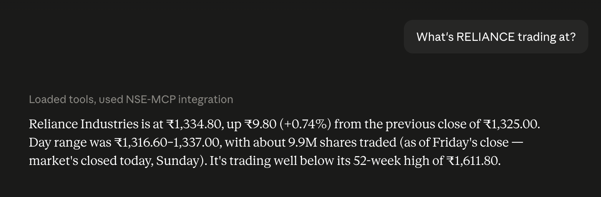

# nse-mcp

**An open, remote MCP server for NSE (National Stock Exchange of India) market data.**
One URL. No API key, no install, no account.

```
https://nse-mcp.pritampatil.workers.dev/mcp
```

Ask your AI assistant about Indian stocks and it answers from live data: quotes, index levels, market status, corporate announcements, dividend/split ex-dates, and price history — every answer stamped with its IST timestamp.



## Quickstart

**claude.ai / Claude Desktop**

1. Open **Settings → Connectors → Add custom connector**
2. Paste `https://nse-mcp.pritampatil.workers.dev/mcp`
3. Ask: _"What's RELIANCE trading at?"_

**Claude Code**

```bash
claude mcp add --transport http nse-data https://nse-mcp.pritampatil.workers.dev/mcp
```

**Cursor**

1. Open `~/.cursor/mcp.json` (or **Settings → MCP → Add new server**)
2. Add:
   ```json
   {
     "mcpServers": {
       "nse-data": { "url": "https://nse-mcp.pritampatil.workers.dev/mcp" }
     }
   }
   ```
3. Ask the agent: _"Is the Indian market open right now?"_

## Tools

| Tool                    | What it does                                                                                        | Try asking                                 |
| ----------------------- | --------------------------------------------------------------------------------------------------- | ------------------------------------------ |
| `get_quote`             | Latest price, change, day & 52-week range, volume for one stock                                     | _"What's RELIANCE trading at?"_            |
| `search_symbol`         | Resolve a company name or fuzzy ticker to its NSE symbol                                            | _"What's the ticker for Tata Motors?"_     |
| `get_indices`           | NIFTY 50 and NIFTY BANK levels with change                                                          | _"How's the Nifty doing today?"_           |
| `get_market_status`     | Whether NSE is open or closed, across all segments                                                  | _"Is the Indian market open right now?"_   |
| `get_announcements`     | Corporate filings with links — one company or market-wide                                           | _"Latest announcements from HDFC Bank"_    |
| `get_corporate_actions` | Dividends, bonuses, splits, rights with ex-dates; omit the symbol for upcoming ex-dates market-wide | _"Any bonus or split ex-dates this week?"_ |
| `get_price_history`     | OHLC bars over a period — stocks, plus NIFTY 50 / BANKNIFTY                                         | _"6-month chart for NIFTY BANK"_           |

Details that make these pleasant to use from a model:

- **Company names just work** — pass "Tata Motors" to a quote tool and the error tells the model to call `search_symbol`; index aliases (`NIFTY 50`, `BANKNIFTY`) route to the right tool automatically.
- **Compact text, not JSON dumps** — every response is short `label: value` text ending with `as of <time> IST`.
- **Honest degradation** — if an upstream source is down, the last cached value is served with an explicit `Note: stale` line instead of an error.

## Architecture

```
MCP client (claude.ai / Desktop / Cursor / Claude Code)
        │  streamable HTTP
        ▼
Cloudflare Worker (@modelcontextprotocol/server + Cloudflare agents SDK)
        │
        ├── Workers KV cache ─ quotes 60s during NSE hours / 15 min off-hours,
        │                      announcements & actions 15 min, history 1 h,
        │                      stale-served-on-failure (7-day retention)
        │
        ├── NSE public endpoints ─ market status, corporate announcements,
        │                          corporate actions, EQUITY_L symbol master
        │                          (refreshed weekly by cron, Mon 01:00 UTC)
        │
        └── Yahoo Finance chart v8 ─ quotes & OHLC history
            (NSE's own quote API blocks non-browser clients — documented
             in DATA_SOURCES.md, which records every probe behind these choices)
```

Stateless Worker, no database, no secrets. The only stored state is the KV cache and the weekly symbol list.

## Running your own

```bash
git clone https://github.com/pritam-patil/nse-mcp && cd nse-mcp
npm install
npx wrangler kv namespace create CACHE   # put the id in wrangler.jsonc
npm run deploy
npm run refresh-symbols                  # seed the symbol list (cron refreshes it weekly)
```

`npm run dev` serves it locally at `http://localhost:8787/mcp`; `npm test` runs ~320 unit tests against recorded fixtures, no network needed.

**Free-tier note:** the whole thing fits comfortably in Cloudflare's free plan — Workers free tier allows 100k requests/day, and the KV cache means most tool calls never touch an upstream. There is no billing surprise lurking in this repo.

## How this compares

This server optimizes for exactly one thing: **zero-friction market context in an AI conversation.** No API key, no install, no account, no OAuth — one URL that works in any MCP client. That focus means it deliberately doesn't cover everything, and for those needs you should use the projects that do:

- **Portfolio access & trading** — a data server can't see your holdings. Use your broker's MCP, e.g. [Zerodha's official Kite MCP](https://github.com/zerodha/kite-mcp-server) (hosted at `mcp.kite.trade`), which does portfolios, positions, and order placement against your own account.
- **Screeners, fundamentals & market breadth** — screening 8,000+ NSE/BSE stocks by 300+ ratios, FII/DII flows, technicals. Use [Tapetide](https://github.com/Tapetide-hq/tapetide-stock-research-mcp) (account + free-tier call quota) or [nse-bse-mcp](https://github.com/bshada/nse-bse-mcp) (60 tools, self-hosted).
- **BSE, derivatives, mutual funds** — out of scope here; both projects above cover parts of this.

If you want an assistant that can answer "what's RELIANCE at, is the market open, any ex-dates this week" with nothing to set up, this is the one. If you outgrow it, the links above are the upgrade paths.

## Data & disclaimer

Data comes from NSE's public endpoints and Yahoo Finance, cached briefly at the edge. **Informational use only — this is not investment advice, and data may be delayed or incomplete.** Do not use it as the basis for trading decisions. Source reliability, rate-limit behaviour, and every probe that shaped these choices are documented in [DATA_SOURCES.md](DATA_SOURCES.md).

## License

[MIT](LICENSE)
